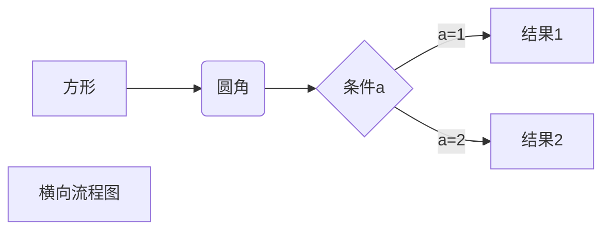

title
============
subtitle
------------
1. list
    \* escaper chracter:  
    new line end with 2+ spaces instead of CTRLF:  
    * a space between
    * item 2
    * item 3 
        + subitem 1
        + subitem 2
          - subsubitem 3 
2. code snippet
    
    `class Base{  
        区块
    }`

        void funtion(){
            代码块，以 tab 开头
        }
    
     <!-- 代码块以```... ``` -->
      代码块以\```... ``` 括起来
    ```
    class second{
        public:
        int char;
       
    }
    ```
3. hypotext  
[markdown grammer](https://www.runoob.com/markdown/md-link.html)  

4. table  
    empty line before table

|**align left**|**align medi**|align right|
|:-----|:-----:|-----:| 
|worddddddd|worddddddddd|wordddddd|
|123|123|123|
|1|1|1|     


5.  comment: `<!--注释 typora？ -->`

6. math: $$ latex or tex $$    
   
   $$  
   \mathbf{V}_1 \times \mathbf{V}_2 =  
   \begin{vmatrix} 
   \mathbf{i} & \mathbf{j} & \mathbf{k} \\
   \frac{\partial X}{\partial u} &  \frac{\partial Y}{\partial u} & 0 \\\frac{\partial X}{\partial v} &  \frac{\partial Y}{\partial v} & 0 \\ 
   \end{vmatrix}
${$tep1}{\style{visibility:hidden}{(x+1)(x+1)}}
   $$

7. 


